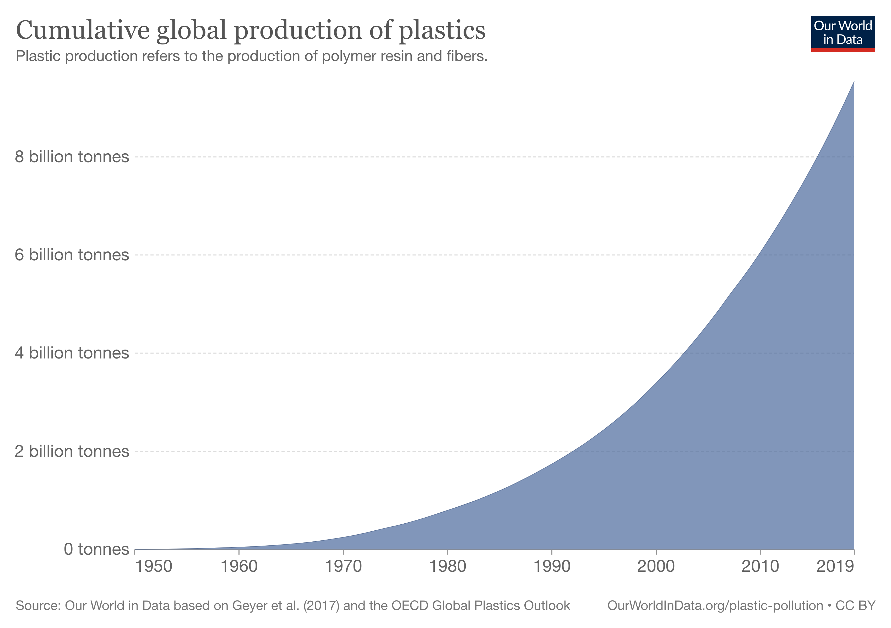
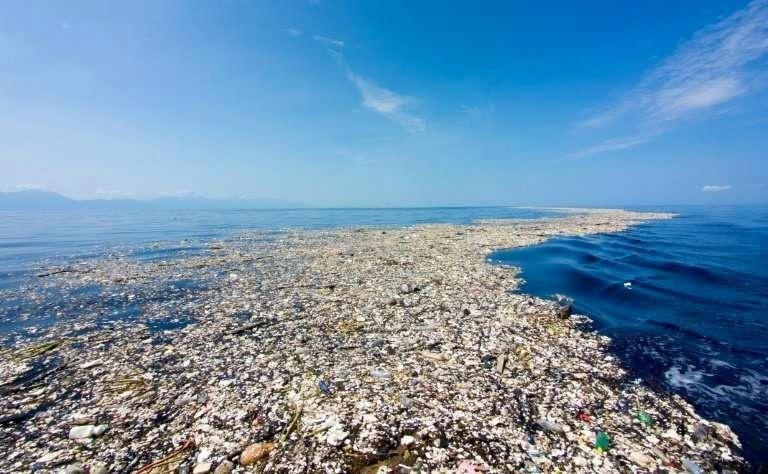
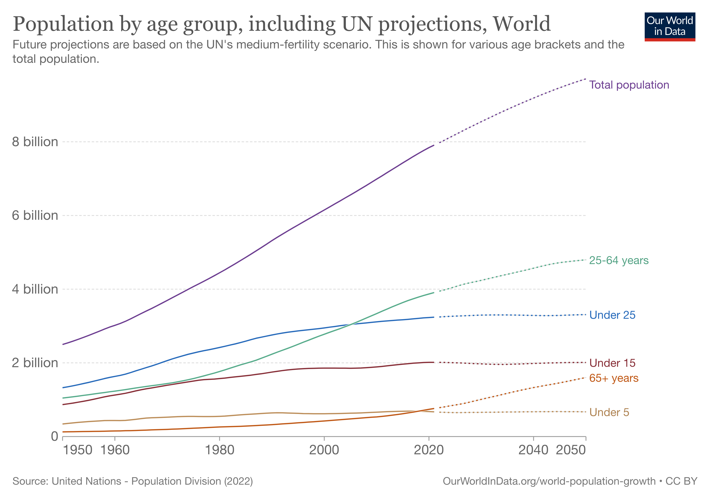

# 👋 Welcome

## Overview


Did you know ? Every day that passes, someone is left without the opportunity to study, someone pollutes our planet again, someone dies from not having clean water or from hunger, children who out of necessity and others out of obligation end up working and NOT playing or going to school, as it should be.


> ## Let's see some graphs


#### &#x20;Plastics production worldwide

* On the one hand we are changing the use of fossil fuels to renewable energies, sunlight, hydrogen and electricity, but on the other hand the amount of carbon-based waste that we generate unbalances the balance again and as we increase in population we continue to generate waste even more exponentially.


<figure><figcaption>
link source: <a href="https://ourworldindata.org/grapher/cumulative-global-plastics">https://ourworldindata.org/grapher/cumulative-global-plastics</a>
</figcaption></figure>

<figure><figcaption>
plastic islands
</figcaption></figure>


#### World population projected towards 2050

* Our resources will not give enough for the next generations according to the current rate of growth of the world's population.


<figure><figcaption>
link source: <a href="https://ourworldindata.org/grapher/population-by-broad-age-group">https://ourworldindata.org/grapher/population-by-broad-age-group</a>
</figcaption></figure>


At Sustain Labs we believe that we can contribute greatly to solving sustainable problems, thanks to our commitment, technologies and because it is something that involves all of us globally and generationally.


> With Loom, you can record your camera, microphone, and desktop simultaneously. Your video is then instantly available to share through Loom's patented technology.
>
> — From the [Loom Docs](https://support.loom.com/hc/en-us/articles/360002158057-What-is-Loom-)

> The Mailchimp Marketing API provides programmatic access to Mailchimp data and functionality, allowing developers to build custom features to do things like sync email activity and campaign analytics with their database, manage audiences and campaigns, and more.
>
> — From the [Mailchimp Marketing API docs](https://mailchimp.com/developer/marketing/docs/fundamentals/)

## Quick links


[what-is-slabs.md](introduction/what-is-slabs.md)



[our-purpose.md](introduction/our-purpose.md)


## Get Started

We've put together some helpful guides for you to get setup with our product quickly and easily.


[getting-set-up](fundamentals/getting-set-up/)



[setting-permissions.md](fundamentals/getting-set-up/setting-permissions.md)



[inviting-members.md](fundamentals/getting-set-up/inviting-members.md)

